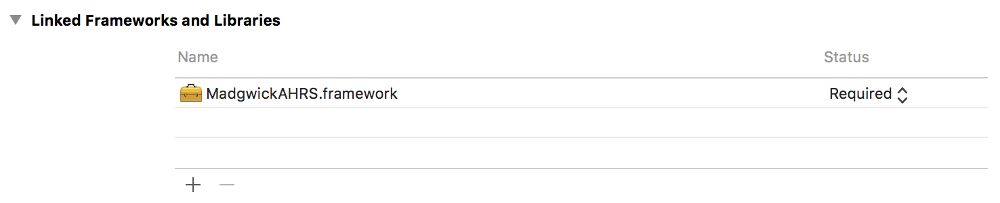
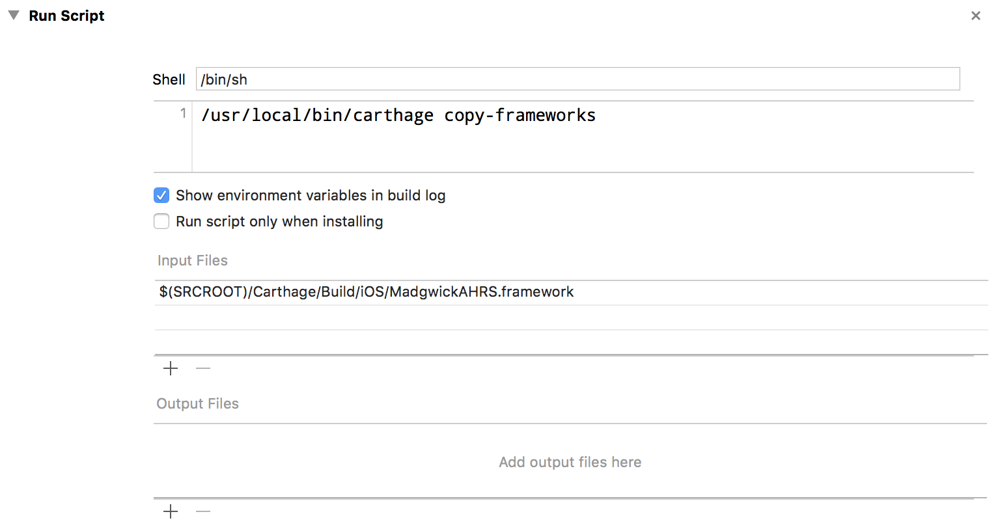

# MadgwickAHRS

[](https://raw.githubusercontent.com/softwarenerd/MadgwickAHRS/master/LICENSE.md)  [](https://github.com/Carthage/Carthage)

[MadgwickAHRS](http://www.x-io.co.uk/open-source-imu-and-ahrs-algorithms/) is a port of the [C implementation](http://www.x-io.co.uk/res/sw/madgwick_algorithm_c.zip) of MadgwickAHRS to an iOS Framework written in Objective-C.

## Getting Started

MadgwickAHRS should be used via [Carthage dependency manager](https://github.com/Carthage/Carthage). Follow the [Carthage build instructions](https://github.com/Carthage/Carthage#if-youre-building-for-ios-tvos-or-watchos) for building for iOS. Essentially:

#### Add MadgwickAHRS to your Cartfile

```github "softwarenerd/MadgwickAHRS"```

#### Add MadgwickAHRS.framework to Linked Frameworks and Libraries



#### Add Copy Frameworks Run Script

Add a run script that uses the ```carthage copy-frameworks``` command to copy the ```MadgwickAHRS.framework``` 



## Usage

See [CoreMotionMadgwickTestDriver](https://raw.githubusercontent.com/softwarenerd/MadgwickAHRS/master/MadgwickAHRS/CoreMotionMadgwickTestDriver.m) for a sample of how to use MadgwickAHRS. 

## RawIMU Sample App

The [RawIMU](https://github.com/softwarenerd/RawIMU) project contains a sample app that uses MadgwickAHRS.

#### Clone Raw IMU

`~/Code git clone git@github.com:softwarenerd/RawIMU.git`

#### Optionally, Build Carthage Dependencies

```~/Code/RawIMU carthage bootstrap```

## Known Issues

* Additional unit tests would be nice.

## License

MadgwickAHRS is released under the [GNU General Public License](LICENSE.md).
